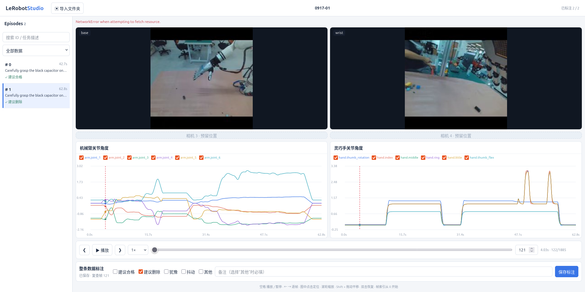

# LeRobotStudio

基于 Python + Web 的 LeRobot v3 数据质检平台，支持多相机与关节曲线同步查看、逐帧播放和 episode 标注，无需 Node.js。



## 启动

```bash
conda activate lerobot_v3
cd /home/zycheng/projects/BC_Tools/LeRobotStudio
pip install -r requirements.txt
python -m lerobot_studio
```

打开 http://127.0.0.1:8765，点击“导入文件夹”，选择包含 `meta/info.json` 的数据集目录。路径指向 Python 服务所在机器，启动时不自动加载数据。

## 配置

参数位于 [config.yaml](config.yaml)：

- `server`：监听地址与端口，默认仅本机访问。
- `dataset.browse_root`：文件夹浏览起始目录及可导入范围。
- `ui.camera_slots`：预留相机位置，默认 4 个，可改为 2。
- `charts`：关节特征及分组，默认按 `arm.` / `hand.` 区分，也可指定 `indices`；数值保持原始单位。
- `playback` / `annotation`：播放倍速、图像质量及预制标注项目。

## 操作

- **数据选择**：左侧搜索 episode，筛选已标注 / 未标注数据。
- **同步播放**：支持 1×、1.5×、2×；空格播放 / 暂停，左右方向键逐帧移动，拖动时间轴或输入帧索引定位（从 0 开始）。
- **关节曲线**：点击或拖动定位帧，滚轮缩放，Shift + 拖动平移，双击恢复；图例可开关关节。
- **标注**：底部多选“建议合格”“犹豫”“抖动”“其他”，选择“其他”需填写备注。支持修改，切换数据时自动保存；无效标注会阻止切换。

标注按 `episode_index` 保存到数据集的 `meta/annotation.json`，记录标签、备注和复查帧，保留 `point` 等扩展字段，不修改原始数据。预填的空标签记录视为未标注。

当前支持 LeRobot `v3.0` 的视频模式，不支持嵌入 parquet 的图像模式。播放较慢时会跳过显示帧追赶进度，逐帧查看不跳帧。同一数据目录请只启动一个服务进程。
